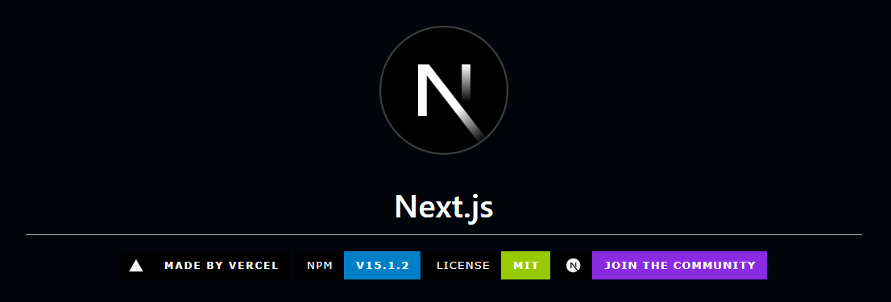
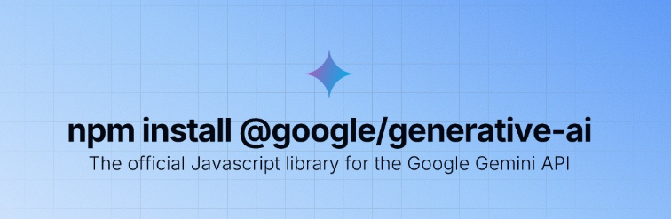

# Educational Crypto Learning Hub





Welcome to the **Educational Crypto Learning Hub**! 🚀

This platform is designed to help beginners learn about cryptocurrency, blockchain technology, and trading using real-time data.

## Features

- **Integration with Gemini for Live Price Tracking**: Stay updated with real-time cryptocurrency prices directly within our learning modules.
- **Interactive Tutorials**: Engage with step-by-step guides on how to trade crypto effectively.
- **Community Forums**: Join discussions, ask questions, and share knowledge with fellow learners.
- **Certification Courses with Gamified Achievements**: Earn certificates and unlock achievements as you progress through our courses.

## Technologies Used

- **Frontend**: Built with [Next.js 13+](https://nextjs.org/) and styled using [Tailwind CSS](https://tailwindcss.com/).
- **Backend**: Developed with [TypeScript](https://www.typescriptlang.org/).
- **API Integration**: Utilizes the [Gemini API](https://docs.gemini.com/rest-api/) for real-time cryptocurrency data.

## Project Structure

The project is organized as follows:


## Setup Instructions

1. **Clone the Repository**:

   ```bash
   git clone https://github.com/your-username/crypto-learning-hub.git


cd crypto-learning-hub
npm install


## Contributing

We welcome contributions to enhance the platform. Please follow these steps to contribute:

1. **Fork the Repository**: Click the "Fork" button at the top-right corner of this page to create a personal copy of the repository.

2. **Create a New Branch**: Navigate to your forked repository and create a new branch for your changes.

3. **Make Your Changes**: Implement your changes in the new branch.

4. **Commit Your Changes**: Commit your changes with a descriptive message.

5. **Push to Your Fork**: Push your changes to your forked repository on GitHub.

6. **Submit a Pull Request**: Navigate to the original repository and submit a pull request from your forked repository.

Please ensure that your code adheres to the project's coding standards and includes appropriate tests.

## License

This project is licensed under the MIT License. :contentReference[oaicite:0]{index=0}

You can view the full license text in the [LICENSE](LICENSE) file.

## Acknowledgments

We would like to express our gratitude to the following projects and services:

- **Gemini API**: For providing real-time cryptocurrency data.

- **Next.js**: For the React framework.

- **Tailwind CSS**: For utility-first CSS styling.

- **TypeScript**: For static type checking.

For more information, visit our [website](https://crypto-learning-hub.com).
